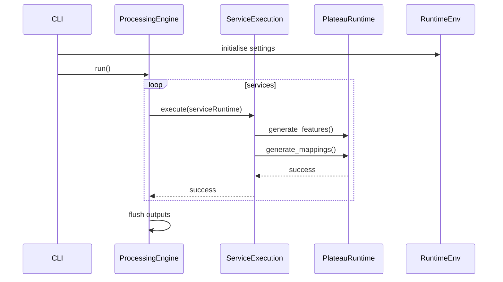

# Runtime architecture

This project evaluates services by composing a small set of engines.
Each layer has a single responsibility and retains its output until the
final aggregation step, enabling deterministic runs and comprehensive
telemetry.

## Design principles

- **Central runtime state** – the CLI initialises a singleton
  `RuntimeEnv` which stores configuration, caches and run metadata. All
  modules fetch this instance via `RuntimeEnv.instance()` instead of
  passing settings through call chains.
- **Isolated execution engines** – `ProcessingEngine` creates a
  `ServiceRuntime` for each service and drives a `ServiceExecution` that
  mutates it. Plateau-specific work occurs inside `PlateauRuntime`
  instances spawned by the service executor.
- **Success signalling** – engines return only a boolean outcome while
  storing generated artefacts on their runtime objects.
- **Lazy loading with caching** – prompts, plateau definitions and other
  artefacts are loaded on first access and memoised for reuse. The
  runtime reset clears these caches to force fresh loads when needed.

The command‑line interface wires these pieces together. It parses user
flags, constructs application settings and initialises the global
``RuntimeEnv``. After configuration, the CLI launches a
``ProcessingEngine`` which loads service data, spawns per‑service and
per‑plateau runtimes and finally writes the aggregated output.

## Runtime environment

`RuntimeEnv` is a thread-safe singleton initialised in `cli.main()`.
It loads configuration, exposes global settings and run metadata, and
holds shared in-memory state such as caches. Modules access the
singleton via `RuntimeEnv.instance()` instead of repeatedly loading
configuration files. Execution metadata is read and written through the
`run_meta` property, while `RuntimeEnv.reset()` clears both the metadata
and any cached loaders.

Settings also drive the lazy loaders for prompts, plateau definitions
and role identifiers. Each loader reads configuration paths from the
current `RuntimeEnv` settings on first use and retains the parsed
results in an in-memory cache for subsequent calls. Run metadata is
stored alongside these caches and exposed through
`RuntimeEnv.instance().run_meta`.

## Processing engine

`ProcessingEngine` orchestrates the overall workflow.  It iterates over
services from the input file, builds a `ServiceRuntime` for each and
invokes a `ServiceExecution` to populate it.  The engine reports whether
the batch succeeded and later flushes successful runtime artefacts to
disk.  Because per‑service state is confined to the runtime object,
processing remains deterministic and easy to reason about.

## Service runtime and execution

`ServiceRuntime` is a dataclass capturing the service input, associated
plateau runtimes and output artefacts. `ServiceExecution` is a thin
executor that mutates a `ServiceRuntime` in place. It lazily loads
plateau information, spawns `PlateauRuntime` objects and delegates
feature generation and mapping. The runtime tracks completion via a
public `success` flag, and the executor returns a boolean while the
populated runtime retains all artefacts for later persistence.

## Plateau execution

`PlateauGenerator` orchestrates a sequence of `PlateauRuntime` objects.
Each runtime encapsulates the plateau description, features and mapping
results and exposes `generate_features()` and `generate_mappings()`
helpers. These helpers call model sessions, update on‑disk caches and
store results on the runtime. Execution status is tracked with a public
`success` flag, and a simple `status()` method forwards that flag back to
the processing engine.

## Telemetry and logging

Structured logging and spans are provided by
[Logfire](https://logfire.pydantic.dev/).  The runtime environment
initialiser, the processing engine and each plateau runtime emit
contextual `debug` and `info` events and wrap long‑running operations in
spans.  These spans enable fine‑grained tracing across services and
plateaus, while log levels allow operators to dial in the desired amount
of detail.

## Lazy loading and caching

Prompt templates are lazily loaded with `FilePromptLoader`, which
retains an in-memory cache.  Plateau definitions, default plateau maps
and role identifiers use similar loaders that cache results on first
use.

Feature and mapping outputs are cached on disk.  The cache root defaults to
``${XDG_CACHE_HOME:-/tmp}/service-ambitions`` and the layout is scoped by
context, service and plateau:

```
<cache_dir>/<context>/<service_id>/<descriptions>.json
<cache_dir>/<context>/<service_id>/<plateau>/<features>.json
<cache_dir>/<context>/<service_id>/<plateau>/mappings/<set>/<file>.json
```

Legacy files are discovered and relocated to the canonical structure.
Caches are indented JSON dictionaries for easy inspection.  Invalid or
non‑dictionary content halts processing with a descriptive error.

## Flow overview

The following sequence summarises a typical run:



